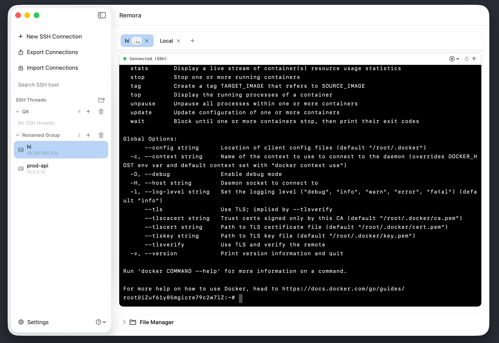
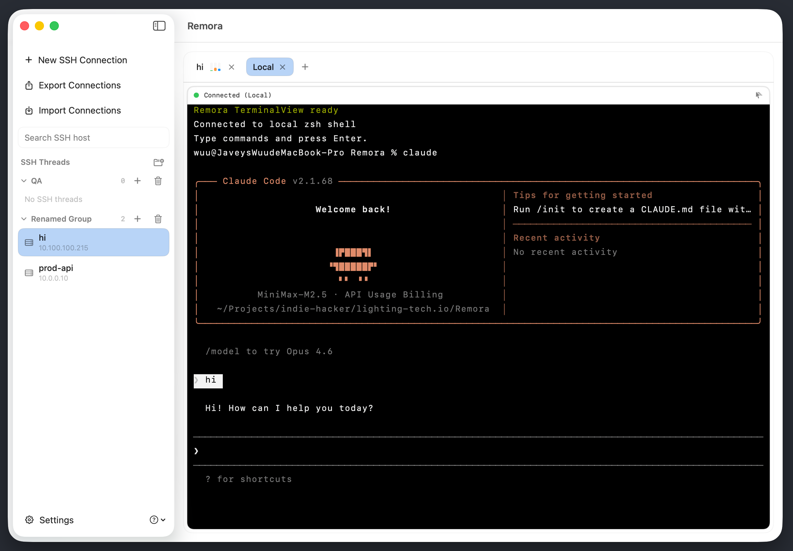
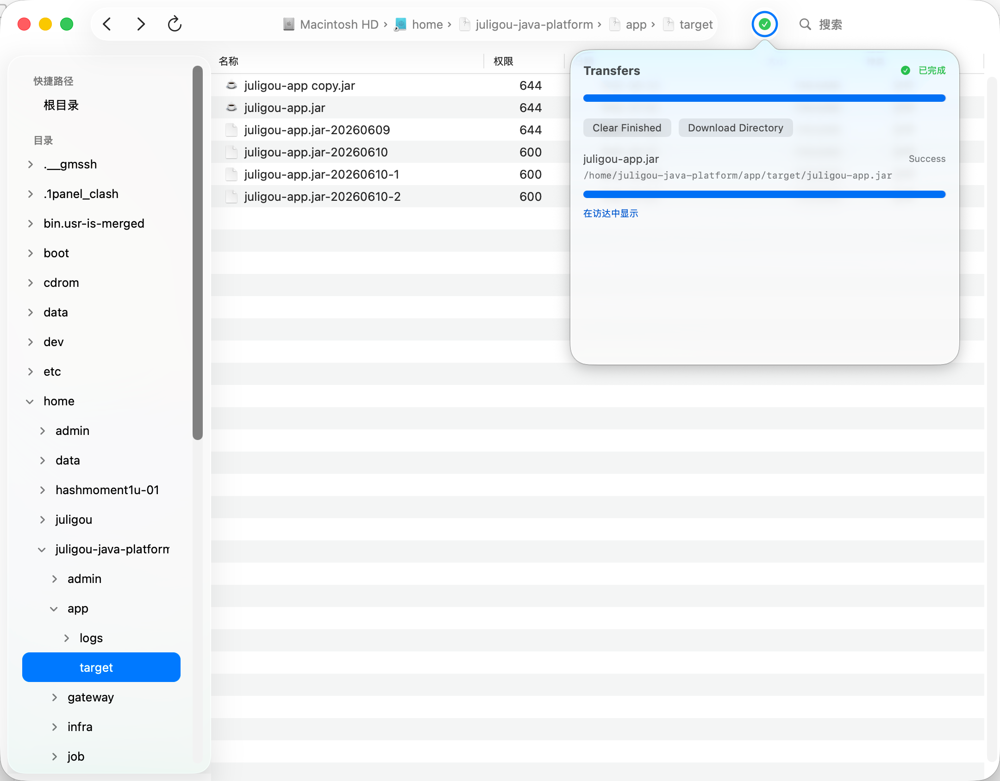
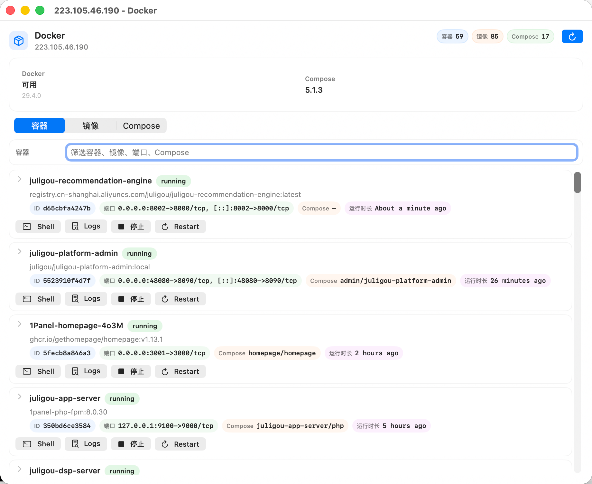

<p align="center">
  
</p>

<h1 align="center">Remora</h1>

<p align="center"><strong>A lightweight, native macOS shell workspace with AI built in.</strong></p>

<p align="center">
A native macOS SSH + SFTP + Terminal AI workspace built with SwiftUI, focused on lightweight workflows, native UX, practical AI assistance inside the terminal, and native file/Docker workflows.
</p>

> [!WARNING]
> Remora is still a WIP, early-stage project. Expect rough edges, missing workflows, and behavioral changes between releases. If you hit a bug, regression, or confusing UX, please open an issue as early as possible: <https://github.com/wuuJiawei/Remora/issues>

<p align="center">
  <a href="./README.md">简体中文</a> •
  <a href="./CHANGELOG.md">Changelog</a> •
  <a href="#features">Features</a> •
  <a href="#screenshots">Screenshots</a> •
  <a href="#quick-start">Quick Start</a> •
  <a href="#faq">FAQ</a> •
  <a href="#project-structure">Project Structure</a> •
  <a href="#testing">Testing</a> •
  <a href="#community">Community</a> •
  <a href="#contributing">Contributing</a>
</p>

---

## Why Remora?

Remora focuses on a practical split:

- Native macOS UX for connection/session management.
- SSH + SFTP workflows in one place.
- An AI assistant that fits into terminal work naturally for explanation, command suggestions, and troubleshooting instead of forcing a chat-first workflow.
- A lightweight, mostly Swift-native architecture that keeps the app fast, direct, and easy to reason about.

## Features

- Fantastic: Local-first SSH + SFTP workspace, ANSI/VT support for modern TUIs, xterm-style selection, quick commands/quick paths, drag-and-drop transfers, and a standalone file manager window.
- Beautiful: Native macOS UI with clean split layout, light/dark/system themes, and distraction-free terminal focus.
- AI-assisted: Built-in Terminal AI with provider → model configuration, custom endpoints, OpenAI / Claude compatible APIs, queued prompts, context compression, and command explanation/suggestion flows.
- Extensible: Save local extension scripts in Shell, Python, JavaScript, or Swift, then run global or host-scoped automation from an SSH host context.
- Fast: Swift 6 native architecture with a SwiftTerm-backed terminal stack and native macOS UI, tuned for practical TUI and scroll-heavy workflows.
- Secure: Local-first credential strategy with config and saved passwords stored in local JSON files under `~/.config/remora`, SSH host key verification via `StrictHostKeyChecking=ask`, and explicit opt-in before any plaintext password export or copy.
- Simple: Lightweight app with a 99% Swift-native stack, keyboard-driven workflows, and practical defaults that work out of the box.

### What You Can Do Today

- Run local shell and SSH sessions with multi-tab/pane workspace.
- Manage hosts with groups, search, favorites, and quick connect.
- Use the standalone SFTP file manager window for create/rename/move/delete/copy/paste/upload/download and transfer progress.
- Drag files onto directories or current path with visual upload target hints.
- Get immediate operation feedback via toasts and retry failed transfer tasks.
- Sync terminal directory with file manager navigation when needed.
- Open the native Docker workspace to inspect containers/images/Compose stacks, launch a shell, read logs, stop containers, or restart them.
- Save extension scripts in Settings, or run global/host scripts from a host context menu.
- Use Terminal AI from the side drawer to explain output, suggest the next command, repair common errors, and compress long conversations automatically.
- Configure language, appearance, shortcuts, and metrics in settings.

### Extension Scripts

Extension scripts run locally on your Mac and are stored in `~/.config/remora/extension-scripts.json`. Remora supports Shell, Python, JavaScript, and Swift scripts, using your local `/bin/zsh` or `/bin/bash`, `python3`, `node`, and `swift` interpreters.

When a script runs from an SSH host context, Remora injects `REMORA_HOST_ID`, `REMORA_HOST_NAME`, `REMORA_HOST`, `REMORA_PORT`, `REMORA_USER`, `REMORA_AUTH_METHOD`, `REMORA_KEY_PATH`, `REMORA_LOCAL_DOWNLOAD_DIR`, and `REMORA_CONTEXT_JSON`. `REMORA_CONTEXT_JSON` points to a temporary JSON file with fuller host context. For security, Remora does not inject passwords, tokens, or private key contents by default; only run scripts from sources you trust.

## Screenshots

<table>
  <tr>
    <td width="50%" valign="top">
      <strong>SSH Workspace</strong><br />
      
    </td>
    <td width="50%" valign="top">
      <strong>Terminal (TUI-friendly)</strong><br />
      
    </td>
  </tr>
  <tr>
    <td width="50%" valign="top">
      <strong>Standalone File Manager + Transfer Progress</strong><br />
      
    </td>
    <td width="50%" valign="top">
      <strong>Terminal AI Conversation</strong><br />
      
    </td>
  </tr>
  <tr>
    <td width="50%" valign="top">
      <strong>Native Docker Workspace</strong><br />
      
    </td>
    <td width="50%" valign="top">
      <strong>Terminal AI Settings</strong><br />
      
    </td>
  </tr>
</table>

## Quick Start

### Requirements

- macOS 14.0 (Sonoma) or later
- Xcode 15.4+

### Run from Source

```bash
swift build
swift run RemoraApp
```

If you prefer Xcode, open `Remora.xcodeproj`, let Xcode resolve Swift packages on first launch, and run the `Remora` scheme.

### Package Locally

Local packaging and GitHub Actions use the same command:

```bash
./scripts/package_macos.sh --arch "$(uname -m)" --version 0.0.0-local --build-number 1
```

The packaged app is written to `dist/`, for example:

```bash
dist/Remora-0.0.0-local-macos-arm64.zip
```

Optional stress tool:

```bash
swift run terminal-stress
```

## Testing

Run core test suites:

```bash
swift test
```

Run UI automation (opt-in):

```bash
REMORA_RUN_UI_TESTS=1 swift test --filter RemoraUIAutomationTests
```

If `RemoraApp` binary path is custom:

```bash
REMORA_RUN_UI_TESTS=1 REMORA_APP_BINARY=/abs/path/to/RemoraApp swift test --filter RemoraUIAutomationTests
```

## FAQ

### Q: macOS says "`Remora.app` is damaged and can't be opened". What should I do?

A: First confirm the app came from a trusted source (for example, GitHub Releases) and was fully unzipped.  
Then remove the quarantine attribute in Terminal (replace with your local path):

```bash
xattr -dr com.apple.quarantine /path/to/Remora.app
```

### Q: It still won't open after removing quarantine. What next?

A: Allow it once from macOS Settings:

1. Open `System Settings` -> `Privacy & Security`.
2. Find the blocked `Remora.app` notice in the Security section.
3. Click `Open Anyway` and confirm.

## Project Structure

- `Sources/RemoraCore`: SSH/SFTP/session/host/security/core models.
- `Sources/RemoraTerminal`: SwiftTerm adapter layer and app-facing terminal view integration.
- `Sources/RemoraApp`: SwiftUI app, workspace UI, settings, file manager.
- `Sources/TerminalStressTool`: terminal throughput/stress utility.
- `Tests/*`: core, terminal, and app tests.
- `docs/`: checklists, screenshots, and operational notes.

## Contributing

Contributions are welcome.

- Please read [`CONTRIBUTING.md`](./CONTRIBUTING.md) before opening a PR.
- Please follow [`CODE_OF_CONDUCT.md`](./CODE_OF_CONDUCT.md) in community spaces.
- For bugs/feature requests, use [GitHub Issues](https://github.com/wuuJiawei/Remora/issues).

## Community

- GitHub: [wuuJiawei/Remora](https://github.com/wuuJiawei/Remora)
- Issues: [Report a bug / request a feature](https://github.com/wuuJiawei/Remora/issues)
- Support: [`SUPPORT.md`](./SUPPORT.md)
- X (updates): [@1Javeys](https://x.com/1Javeys)

## Acknowledgements

Remora was shaped by ideas, tooling, or implementation inspiration from the following projects and products:

- [sst/opencode](https://github.com/sst/opencode)
- [code-yeongyu/oh-my-opencode](https://github.com/code-yeongyu/oh-my-opencode)
- [migueldeicaza/SwiftTerm](https://github.com/migueldeicaza/SwiftTerm)
- [OpenAI](https://github.com/openai)
- [Claude Code](https://github.com/anthropics/claude-code)

Special thanks to the [2Libra](https://2libra.com/) and [V2EX](https://www.v2ex.com/) communities.

Their early users shared a lot of valuable feedback and surfaced many issues, which helped the product improve and mature significantly.

Thanks to everyone who took the time to try Remora, discuss it, suggest improvements, and point out problems.

## Security

Please read [`SECURITY.md`](./SECURITY.md) for responsible disclosure.

## License

Licensed under the MIT License. See [`LICENSE`](./LICENSE).
