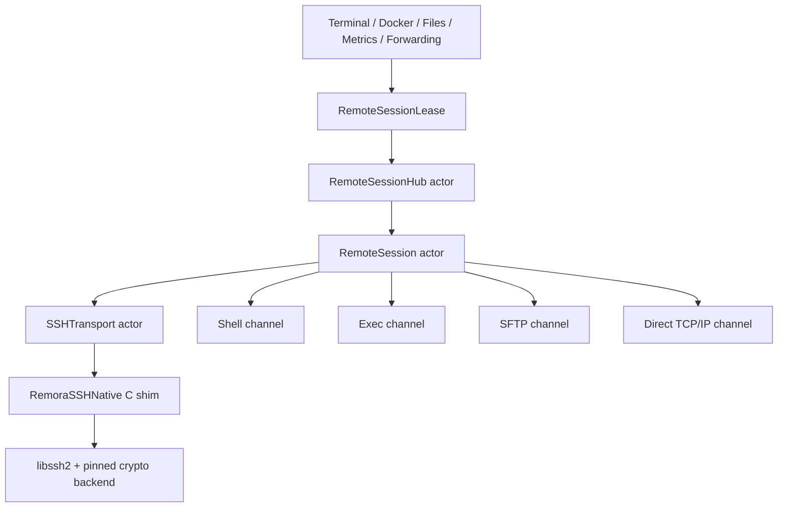
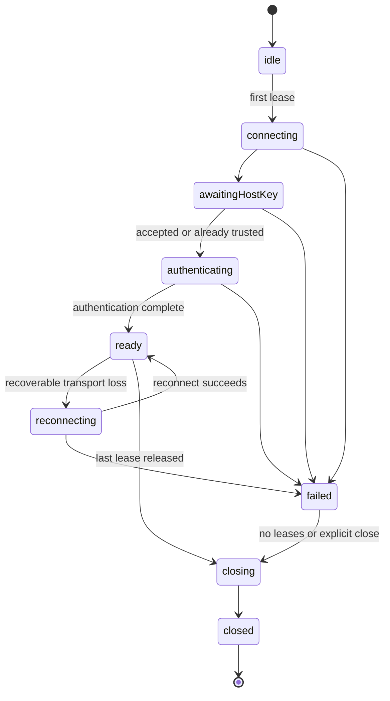

# Native SSH Session Architecture

**Status:** Accepted for staged implementation  
**Date:** 2026-07-22  
**Branch:** `codex/native-ssh-session`  
**Decision owner:** Remora  

## 1. Problem statement

Remora currently presents one terminal session, but terminal, Docker, file manager,
metrics, archive tools, remote editor, and port forwarding do not share one SSH
transport. They independently start `/usr/bin/ssh` or `/usr/bin/sftp` processes.

That model works for a direct host when every process can independently authenticate.
It breaks for JumpServer because the interactive terminal contains authentication and
target-selection state that the later processes do not own. The Docker and file
windows therefore reconnect only to the saved JumpServer host, not to the asset that
the user selected inside the terminal.

The empty panels and misleading Docker permission warning are symptoms. The root cause
is that Remora models a shell process as the connection, while SSH models a connection
as one authenticated transport containing multiple channels.

## 2. Evidence from the current code

| Area | Current behavior | Structural issue |
|---|---|---|
| Terminal | `SessionManager` creates `OpenSSHProcessClient`, then one PTY shell process | The client is discarded after shell creation; there is no reusable transport |
| Runtime identity | `TerminalRuntime.connectedSSHHost` exposes the saved `Host` | It cannot represent the JumpServer asset/account selected after login |
| Docker | `DockerPanelViewModel` creates `SystemSFTPClient` and runs remote commands through it | Docker starts a new authentication flow and command execution is attached to the wrong abstraction |
| File manager | `FileManagerWorkspaceWindowManager` creates a new `SystemSFTPClient` | The window does not own or lease the terminal's authenticated session |
| Metrics | `ServerMetricsCenter` caches `SystemSFTPClient` by saved host | Sampling starts a separate SSH command path and uses the wrong runtime identity |
| Port forwarding | `OpenSSHPortForwardProcess` starts another `/usr/bin/ssh` | Forwarding cannot share gateway authentication or lifecycle |
| SFTP protocol | `SFTPClientProtocol` contains file APIs and shell-command APIs | Filesystem and command capabilities cannot evolve independently |
| Connection reuse | Control paths are separated by shell/SFTP/command/forward purpose | The paths intentionally prevent the features from sharing one master |
| Password sessions | Stored-password launches often disable ControlMaster | Even direct-host process reuse is inconsistent |
| Error rendering | Authentication/route failures collapse into Docker permission or empty file state | The UI hides the actual failure layer |

The existing `requireExistingSSHConnection` Docker mode has no enforceable semantics:
both code paths construct a `SystemSFTPClient`. It is a naming-level fallback, not a
session guarantee.

## 3. Goals

1. Terminal, Docker, files, metrics, remote tools, and forwarding use channels from one
   authenticated `RemoteSession` when they refer to the same runtime target.
2. JumpServer is a first-class connection route with an explicit target asset,
   platform account, asset account, and protocol before the session connects.
3. Keyboard-interactive authentication supports any number of prompt rounds without
   parsing terminal output.
4. Host-key verification is performed before authentication and has a typed user
   decision flow.
5. Normal file access uses an SFTP subsystem channel. Administrator file access uses
   an exec channel running `sudo -n sftp-server` and still speaks SFTP, not shell text.
6. Remote commands are separate from file APIs and carry explicit idempotency and
   privilege metadata.
7. Independent terminal, Docker, and file windows hold leases. Closing one window does
   not disconnect the others.
8. No network or disk I/O is performed on the main actor.
9. Migration ends with deletion of the OpenSSH process transport, ControlMaster
   machinery, and shell-command methods on `SFTPClientProtocol`.

## 4. Non-goals

- Reimplementing an SSH cryptographic stack in Swift.
- Inferring an asset from terminal title, prompt, current directory, or transcript.
- Preserving every current internal type name or compatibility branch.
- Automatically replaying commands that may have side effects.
- Adding Windows support; Windows is comparison evidence, not a platform target.
- Redesigning unrelated terminal rendering, file manager layout, or Docker UI.

## 5. Architectural decision

Remora will use a native SSH transport backed by `libssh2`, isolated behind a C shim
target named `RemoraSSHNative`. `RemoraCore` will own session, route, channel,
authentication, host-key, command, and filesystem abstractions. AppKit/SwiftUI code
will consume capabilities and leases; it will not construct transport clients.



OpenSSH remains only while specific consumers are being migrated. It is not a
production fallback after the final migration gate.

## 6. Module boundaries

### 6.1 `RemoraSSHNative`

Responsibilities:

- Own opaque C handles for socket, libssh2 session, channel, SFTP session, and handles.
- Normalize `LIBSSH2_ERROR_EAGAIN` into explicit nonblocking results.
- Expose handshake, authentication, channel, subsystem, exec, stream, and forwarding
  primitives through a narrow C ABI.
- Copy callback data into caller-owned buffers; never expose libssh2 internal memory to
  Swift after a call returns.
- Convert native result codes into a stable `remora_ssh_error` structure.
- Ensure every native handle has exactly one close/free path.

It must not contain:

- App state, `Host`, JumpServer business rules, Keychain access, logging text, or UI.
- Automatic retries or fallback authentication policy.
- Swift-visible raw `LIBSSH2_SESSION *` pointers.

The candidate upstream revision inspected during design is
`7bf902e510a47fb9866543256ea693f6aba1baf3`. It is not accepted merely because it is
HEAD. The dependency gate must pin a reviewed release/commit, record license and
checksums, and build both arm64 and x86_64 release artifacts. Remora must not depend on
Homebrew at runtime.

The release/backend selection and remaining integration gate are recorded in
`2026-07-22-native-ssh-dependency-decision.md`. The selected pair is libssh2 1.11.1 with
mbedTLS 3.6.7 LTS; source import remains blocked until the universal static-build proof
passes.

### 6.2 `RemoraCore`

New ownership:

- Persisted connection configuration and route migration.
- `RemoteTargetIdentity`, `ConnectionRoute`, and gateway providers.
- `RemoteSessionHub`, `RemoteSession`, and `RemoteSessionLease`.
- Native transport actor and channel wrappers.
- Authentication challenge coordination and host-key policy.
- `RemoteCommandExecutor` and `RemoteFileSystem` implementations.
- Retry classification, cancellation, timeout, and diagnostic events.

Existing `Host` remains the saved user configuration. Renaming it across the repository
would produce a large compatibility diff without correcting runtime identity. The
important change is that live feature code stops treating `Host` as the authenticated
target.

### 6.3 `RemoraTerminal`

- Continues to isolate SwiftTerm.
- Receives a `RemoteShellChannel`, not a process-backed shell implementation.
- Keeps terminal rendering, input, resize, OSC parsing, and ZModem behavior independent
  from transport choice.

### 6.4 `RemoraApp`

- Resolves or requests a `RemoteSessionLease` through `RemoteSessionHub`.
- Presents typed route/authentication/host-key/privilege failures.
- Keeps a lease for each independent window.
- Never creates `SystemSFTPClient`, `OpenSSHProcessClient`, or native handles.

## 7. Core domain model

The exact Swift declarations may be adjusted for actor isolation, but their semantics
are fixed by this document.

```swift
public struct RemoteTargetIdentity: Hashable, Sendable {
    public let savedHostID: UUID
    public let routeProviderID: String
    public let assetID: String?
    public let assetDisplayName: String
    public let accountID: String?
    public let accountUsername: String
    public let protocolName: String
}

public enum ConnectionRoute: Hashable, Sendable {
    case direct(DirectRoute)
    case gateway(GatewayRoute)
}

public struct RemoteSessionKey: Hashable, Sendable {
    public let routeFingerprint: String
    public let target: RemoteTargetIdentity
    public let authenticationIdentity: String
    public let hostKeyPolicyID: String
}
```

`RemoteSessionKey` must exclude presentation state such as window ID, terminal profile,
current directory, and administrator-mode toggle. It must include every field that can
change the authenticated endpoint or security boundary.

### 7.1 Route rules

- A direct route contains the network endpoint and target username.
- A gateway route contains the gateway endpoint, gateway authentication identity,
  provider configuration, and explicit target identity.
- A manual interactive JumpServer shell without a selected target is represented as an
  unbound gateway session. Docker/files/metrics are unavailable with a typed
  `targetNotResolved` reason; they never silently connect to the gateway itself.
- Route providers return canonical identities. Display names are never used as unique
  keys when an asset/account ID is available.

### 7.2 JumpServer provider

`JumpServerGatewayProvider` is responsible for generating and validating the direct
login identity supported by Koko:

```text
JMS_username@protocol@account_username@asset_target
```

It must require these values before opening the transport:

- JumpServer platform username.
- Protocol, initially `ssh`.
- Asset stable identifier or provider-accepted target value.
- Asset account identifier/username.

Connect Token (`JMS-{token}`) can be added by the same provider, but token acquisition
and refresh must remain outside terminal transcript parsing. If an API-backed asset
picker is implemented, it belongs to the provider layer and stores tokens in Keychain.

## 8. Session and lease lifecycle



Rules:

1. `RemoteSessionHub.acquire(...)` deduplicates concurrent requests for the same key.
2. A lease has an explicit `release()` operation. Window/controller teardown must call
   it. A deinit hook may report or schedule cleanup but is not the primary mechanism.
3. A shell channel lease and a session lease are distinct. Closing a shell only closes
   that channel.
4. The last lease starts a short, bounded idle-retention timer only if the product has
   an explicit reuse requirement. The initial implementation closes immediately to
   keep lifecycle deterministic.
5. Closing or failed sessions are removed from the hub before a new acquisition can
   reuse the key.
6. A session serializes all libssh2 access. libssh2 handles are never called from
   arbitrary feature tasks.
7. Cancellation closes only the requesting channel unless transport integrity is lost.

## 9. Transport execution model

`libssh2` will run in nonblocking mode. One transport actor owns the socket and all
native handles. When an operation returns EAGAIN, it awaits socket readiness according
to `libssh2_session_block_directions` and resumes without blocking the main actor.

Fairness rules:

- Shell reads and writes receive latency priority.
- File transfers use bounded chunks and yield between chunks.
- Metrics and directory listing are short operations with concurrency limits.
- A single transfer may not monopolize the actor's executor.
- Channel buffers have fixed high-water marks; consumers apply backpressure.
- No unbounded transcript, stderr, or diagnostic buffer is added.

Initial measurable budgets:

| Metric | Budget |
|---|---|
| Main-thread SSH/SFTP blocking | 0 ms by construction |
| Terminal input-to-channel enqueue p95 | less than 8 ms under one active transfer |
| Terminal output delivery p95 after socket readable | less than 16 ms |
| Directory first-page scheduling | less than 50 ms local overhead |
| Transfer buffer per active stream | at most 1 MiB, target 256 KiB |
| Diagnostic payload retained per operation | at most 16 KiB metadata/error tail |
| Idle session native resources | zero after final lease release |

Budgets are regression thresholds for local instrumentation, not promises about remote
network latency.

## 10. Authentication and host-key security

### 10.1 Authentication methods

The transport exposes methods advertised by the server and supports:

- SSH agent.
- Private key from file and encrypted-key passphrase challenge.
- Password.
- Keyboard-interactive with multiple rounds and multiple prompts per round.

The keyboard-interactive callback may be synchronous inside libssh2. The native call
runs on a dedicated transport executor. A bounded challenge bridge publishes typed
prompts to the app and waits off-main-thread for answers or cancellation. Cancellation
must wake the waiter immediately. Prompt text may be shown to the user but is never
used to infer semantic state such as JumpServer asset selection.

Typed challenge data includes:

- Session ID and challenge ID.
- Prompt ID, text, echo flag, and ordinal.
- Attempt number and server method.
- Deadline and cancellation token.

Secrets are fetched from `CredentialStore` only when an authentication policy requests
them. Secret values, answers, remote command stdin, and private-key content must not be
logged. Buffers are cleared on a best-effort basis after use.

### 10.2 Host keys

Before authentication:

1. Read the server host key and algorithm from libssh2.
2. Check exact endpoint/port entries in the native known-host store.
3. On first use, emit a typed trust challenge with SHA-256 fingerprint.
4. On mismatch, block by default. A separate destructive replace action is required.
5. Persist acceptance atomically through `HostKeyStore`.

Gateway host verification and target identity are separate concepts. For JumpServer
direct-login, the SSH transport verifies Koko's endpoint key; the provider identity
records the downstream asset selected by Koko.

## 11. Channel APIs

### 11.1 Shell

`RemoteShellChannel` provides:

- PTY allocation with terminal type, columns, rows, and pixel dimensions where known.
- Shell startup, stdin write, stdout/stderr stream, resize, EOF, exit status, and close.
- Backpressure-aware output delivery.

ZModem and OSC/CWD integration continue to consume the shell byte stream. They must not
reach into `RemoteSession` native state.

### 11.2 Exec

`RemoteCommandExecutor` replaces command methods on `SFTPClientProtocol`.

```swift
public struct RemoteCommandRequest: Sendable {
    public var executable: RemoteExecutable
    public var arguments: [String]
    public var environment: [String: String]
    public var standardInput: RemoteCommandInput
    public var privilege: RemotePrivilege
    public var replayPolicy: CommandReplayPolicy
    public var timeout: Duration?
}
```

The default builder sends a shell command only when the caller explicitly requests
shell semantics. Structured executable/argument commands use one audited POSIX quoting
implementation at the transport boundary.

Replay policy:

- `.readOnly`: may be retried once after reconnect before any output is observed.
- `.idempotent`: retry only when the caller supplies an operation key and accepts it.
- `.never`: default for Docker mutations, file mutations, archive operations, and any
  command after stdin/output has begun.

### 11.3 Normal SFTP

`LibSSH2RemoteFileSystem` opens an SFTP subsystem through `libssh2_sftp_init` and maps
SFTP status codes to typed filesystem errors. It owns no remote command API.

Required operations include list, stat/lstat, realpath, open/read/write/close, mkdir,
rmdir, remove, rename, set attributes, symlink/readlink where supported, and streaming
upload/download with progress and cancellation.

### 11.4 Administrator SFTP

OpenSSH servers do not normally permit changing the user of a subsystem request.
`libssh2_sftp_init` always opens its own `subsystem sftp` channel and cannot attach its
SFTP engine to an arbitrary exec channel. Therefore administrator mode is a separate
implementation:

1. Discover a supported server path from a fixed allowlist using a read-only command:
   `/usr/lib/openssh/sftp-server`, `/usr/lib/ssh/sftp-server`, then configured override.
2. Open an exec channel with `sudo -n -- <absolute-sftp-server-path>`.
3. Speak SFTP v3 packets over that channel using `RemoraSFTPWire`.
4. Reuse the same `RemoteFileSystem` domain API as normal mode.

`RemoraSFTPWire` must be a bounded binary codec, not a shell-output parser. It validates
packet length before allocation, caps outstanding request count, matches responses by
request ID, rejects malformed attributes, and treats unexpected channel EOF as a
transport error. It supports only the operations Remora uses; unsupported extensions
are explicit errors.

Administrator mode never prompts for a sudo password through hidden automation. It
uses `sudo -n`; failure is reported as `privilegeAuthenticationRequired` with an
actionable message. Supporting interactive sudo later requires a separately designed
credential policy and is not a fallback in this migration.

### 11.5 Forwarding

Local forwarding uses libssh2 `direct-tcpip` channels owned by the session. A local
`NWListener` accepts sockets and pumps bytes with bounded buffers. Forward leases keep
the session alive independently of terminal windows.

## 12. Capability-oriented consumers

| Consumer | New dependency | Must stop doing |
|---|---|---|
| `TerminalRuntime` | `RemoteShellChannel` + session identity snapshot | Publishing a saved `Host` as the live target |
| Docker | `RemoteCommandExecutor` | Constructing SFTP clients; mapping all failures to Docker permission |
| File manager | `RemoteFileSystem` + optional command executor for archive tooling | Constructing transport clients; treating failure as empty directory |
| Transfer queue | Streaming `RemoteFileSystem` handles | Loading full files into memory for normal transfers |
| Remote editor/log | `RemoteFileSystem` | Owning connection lifecycle |
| Archive tools | `RemoteCommandExecutor` with `.never` replay | Executing through SFTP abstraction |
| Metrics | `RemoteCommandExecutor` with `.readOnly` replay and sampling timeout | Caching clients by saved host |
| Port forward | Session forward channel + forward lease | Starting an OpenSSH process |

## 13. Error model and diagnostics

One typed error tree must preserve the layer that failed:

- `route`: missing target, unsupported provider, invalid direct-login identity.
- `network`: DNS, connect timeout, socket closed.
- `hostKey`: unknown, mismatch, rejected.
- `authentication`: method unavailable, rejected, challenge cancelled, challenge timed out.
- `session`: closing, closed, reconnect exhausted.
- `channel`: open rejected, EOF, exit status.
- `command`: timeout, nonzero exit, invalid request, privilege required.
- `fileSystem`: status code, not found, permission denied, malformed response.
- `docker`: command unavailable, daemon unavailable, user permission, parse failure.

UI adapters translate typed errors with `tr(...)`; core errors retain stable codes and
safe diagnostics. A failed directory load preserves the last successful snapshot and
shows an error state. It never replaces the error with an empty success result.

Every operation receives a correlation ID. Safe logs contain:

- Session/lease/channel IDs and route fingerprint prefix.
- State transition, operation kind, duration, byte counts, retry decision.
- Native/libssh2 error code and sanitized server message.
- Target asset/account IDs only in redacted or hashed form.

Logs must not contain passwords, OTPs, private keys, command stdin, file contents,
Connect Tokens, or full command output. Detailed logging is always bounded.

## 14. Reconnection rules

- Reconnect creates a new transport and new channels under the same logical session.
- Host-key and authentication checks run again according to policy.
- A terminal channel may reopen only as a new shell; remote process state is lost and
  the user is informed.
- File reads/listings may restart only before visible partial results or from a verified
  byte offset supported by the transfer layer.
- File writes use temporary remote paths and explicit finalize/rename where the current
  operation already provides atomic semantics. They are never blindly replayed.
- Docker mutations, rename/remove, archive creation/extraction, and exec with `.never`
  fail on disconnect and require user re-invocation.
- Metrics may retry once because its request is read-only.

## 15. Persistence migration

The migration is additive only at the persisted JSON boundary:

1. Existing direct `Host` records decode as `route = direct` with current endpoint and
   username.
2. New optional gateway configuration is versioned and defaults to nil.
3. A JumpServer route stores provider type, platform username identity, target asset,
   target account, and protocol. Secrets remain Keychain references.
4. Export/import adds a schema version. Passwords and tokens remain excluded by default.
5. Old records are not rewritten until the user saves or migration is successfully
   committed atomically.
6. Unknown future provider fields are either preserved in a provider payload or reject
   import explicitly; they are never silently discarded.

No migration guesses that an existing host is JumpServer from its address, banner,
name, tags, or terminal output.

## 16. Deletion policy

The following are migration scaffolding, not permanent alternatives:

- `OpenSSHProcessClient` / `SystemSSHClient`.
- `ProcessSSHShellSession`.
- `SystemSFTPClient`.
- `OpenSSHLaunchBuilder` and ASKPASS/sshpass helpers used only by those clients.
- `SSHConnectionReuse`, `SSHConnectionReusePolicy`, and ControlMaster cleanup.
- `OpenSSHPortForwardProcess`.
- `executeRemoteShellCommand` and `streamRemoteShellCommand` on `SFTPClientProtocol`.
- `connectedSSHHost` as the runtime binding source.
- `requireExistingSSHConnection` mode with no enforceable lease.
- Compatibility retries that parse OpenSSH stderr after native migration covers the
  same negotiated algorithms with typed errors.

Deletion occurs consumer by consumer only after its native path passes the phase gate.
The final release cannot ship a hidden automatic OpenSSH fallback. A temporary,
developer-only feature switch may compare implementations during migration, but it is
removed before the final gate.

## 17. Rejected alternatives

### Expand ControlMaster reuse

Rejected because it still cannot expose a typed authenticated target, share channel
lifecycle, deliver keyboard-interactive prompts to independent processes reliably, or
provide native SFTP/forward channel ownership. It would add more process orchestration
to the root problem.

### Parse the terminal to discover the JumpServer asset

Rejected because prompts, titles, locale, themes, and nested shells are not stable
protocols. It also creates a security risk by trusting unverified terminal output as
identity.

### Keep remote commands on `SFTPClientProtocol`

Rejected because privilege, retries, stdin, stderr, timeout, and idempotency belong to
command execution, not a filesystem.

### Use `swift-nio-ssh` or Citadel as the transport

Rejected for this requirement because the inspected authentication surface does not
provide the keyboard-interactive flow required by JumpServer. Citadel adds useful
channel APIs but inherits that gap.

### Require Homebrew libssh2

Rejected because release users must not install or maintain a native dependency.

### Implement SSH cryptography directly

Rejected as unnecessary security and maintenance risk.

## 18. Acceptance invariants

The architecture is complete only when all are true:

1. A direct host opens terminal, Docker, and file windows through one session key and
   one TCP connection unless the server forces reconnect.
2. A JumpServer direct-login target opens the same three features against the explicit
   asset/account with multi-round MFA.
3. Closing any one of the three windows leaves the other two usable.
4. Closing the last lease releases every channel, native handle, socket, task, and
   listener.
5. File and Docker errors identify route/auth/privilege/feature failures separately.
6. Administrator file mode uses SFTP packets over `sudo -n sftp-server`; no `ls`, `cp`,
   `mv`, `rm`, or locale-dependent parser is used for filesystem semantics.
7. Side-effect operations are never automatically replayed after an ambiguous failure.
8. The application builds and packages for arm64 and x86_64 without Homebrew.
9. OpenSSH process transport and ControlMaster production code are deleted.
10. All transport I/O stays off the main actor and performance budgets have regression
    coverage.
